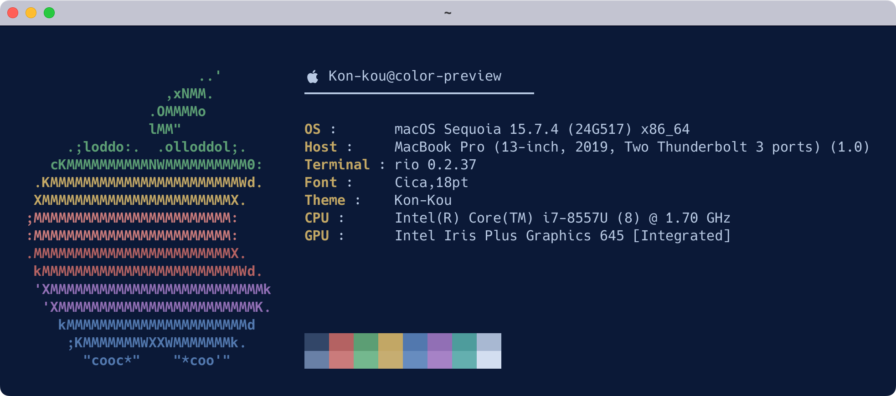
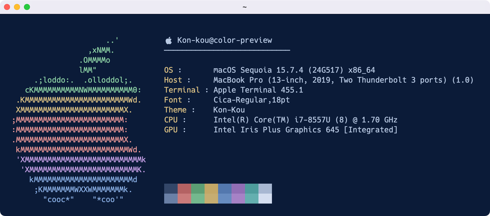

# Kon-kou（紺航）

A color theme for Rio Terminal with a macOS Terminal port.

A deep navy theme evoking a boat’s wake across the night sea.  
深く蒼い海を航る舟、その航跡

---

## Preview

The macOS Terminal version compensates for Terminal’s color rendering to match the Rio version as closely as possible.

> Note:  
> Screenshots were taken during development, and some labels may differ slightly from the final naming ("Kon-kou").

### Rio Terminal



### macOS Terminal (port)



---

## Installation

Download or clone this repository first.

### Rio Terminal

1. Copy the theme file to your Rio Theme directory.  
   `~/.config/rio/themes/Kon-kou.toml`
2. Specify the theme in your Rio configuration file.

```toml
theme = "Kon-kou"
```

### macOS Terminal

1. Open the profile:  
   `macos-terminal/Kon-kou.terminal`  
2. The profile will be added to **Settings → Profiles**.

---

## Variants

**Kon-kou**

Calibrated against Rio Terminal and ported to macOS Terminal.

**Kon-kou Valiant**

A brighter variant inspired by the appearance of the original macOS Terminal version.

**Kon-kou Original (macOS Terminal)**

The earliest version developed on macOS Terminal.

---

## Profiles

### Rio Terminal
  - `rio/Kon-kou.toml`
  - `rio/Kon-kou-valiant.toml`

### macOS Terminal
  - `macos-terminal/Kon-kou.terminal`
  - `macos-terminal/Kon-kou-original.terminal`
  
---

## Notes

Screenshots: **Cica**  
Any monospaced font should work.

---

## License

MIT License
